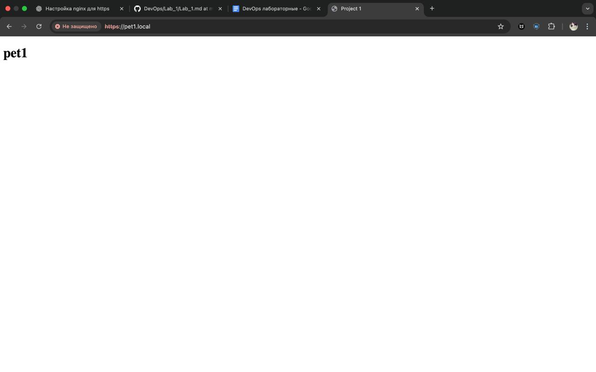
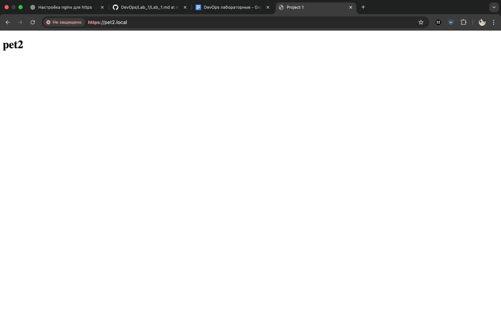
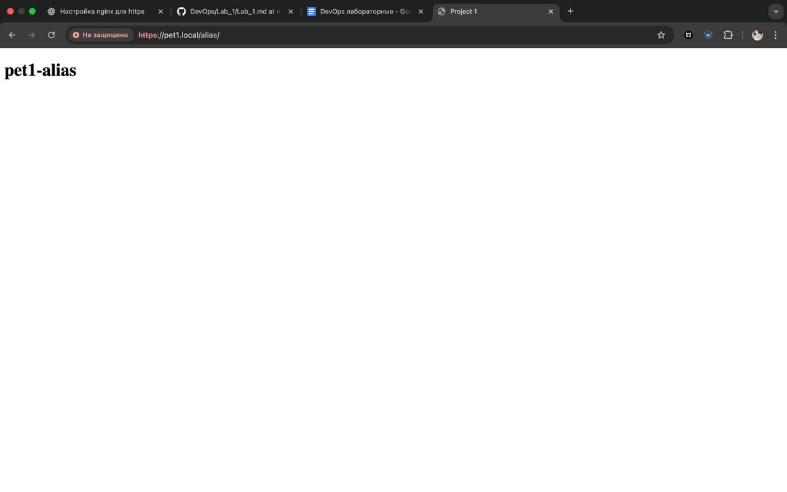

# 1 Лабораторная работа "Настроить nginx по заданному ТЗ"
# ТЗ
1. Должен работать по https c сертификатом
2. Настроить принудительное перенаправление HTTP-запросов (порт 80) на HTTPS (порт 443) для обеспечения безопасного соединения.
3. Использовать alias для создания псевдонимов путей к файлам или каталогам на сервере.
4. Настроить виртуальные хосты для обслуживания нескольких доменных имен на одном сервере.
5. Что угодно еще под требования проекта
# Ход работы
## Nginx
Первое, что нужно было сделать - поставить nginx на компьютер и разобраться как он работает. В моем случае я ставил Nginx на макбук, для этого мне нужно было прописать несколько команд:
``` 
    brew install nginx 
    brew services start nginx 
```
## Pet-Projects
Далее нужно было создать пет проекты, либо же найти в открытых источниках. Я создал 4 html страницы с разным текстом.
## Настройка Nginx
Следующим шагом я начал смотреть видео что такое nginx и как он работает, прочитал документацию, пообщался с AI. На это ушло не так много времени и я понял что нужно делать. Сначала пошагово я разобрался как получить доступ к html страницам с помощью http запроса. Далее начал разбираться с переадресацией на https и alias. 
### SSL/TLS
Для того, чтобы получить https шифровал канал с браузером - нужно иметь ssl/tls сертификат. Можно иметь сертификат из центра сертификации или же сделать самоподписанный сертификат. В случае самоподписанного сертификата при успешном подключении с помощью https браузер в любом случае выдает предупреждение, что подключение не защищено, но это не так. Соединение шифруется даже с самоподписанным сертификатом. В ином случае (сертификат, подтвержденный центром сертификации) браузер ошибок не выдает и сообщает нам, что подключение защищено. 
Я создал сертификат с помощью openssl:
```
 openssl req -x509 -nodes -days 365 -newkey rsa:2048 -keyout pet1.key -out pet1.crt
```
Таким образом, после настройки всего окружения можем посмотреть что у нас получилось:
Pet1 по запросу http://pet1.local/

Pet2 по запросу http://pet2.local/

Pet1 по запросу http://pet1.local/alias

Pet2 по запросу http://pet2.local/alias


# Вывод
Благодаря лабораторной работе №1 я понял что такое nginx и для чего он нужен. Также до этого я не знал **абсолютно ничего** про DevOps инжеренов и их деятельность. Мне понравилось, что я получил новые полезные знания и умения в ходе выполнения данной лабороторной работы, а еще теперь я буду делать небольшие пранки над друзьями на их компьютерах.